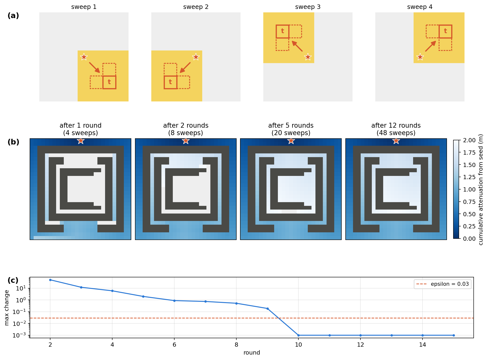
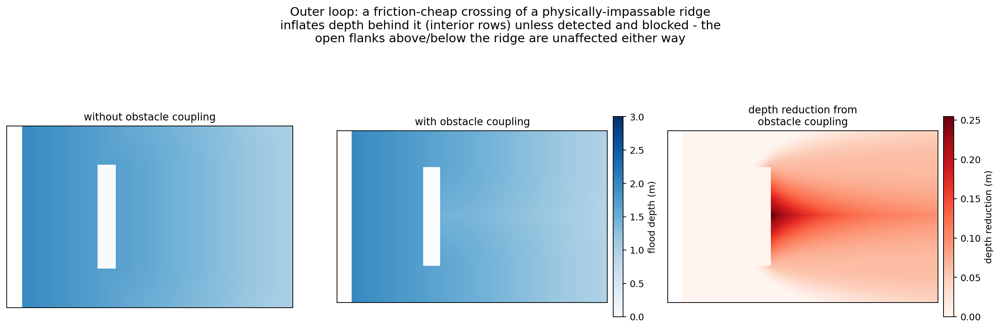

# Method: Friction-Weighted Eikonal Propagation for Coastal Flood Depth Estimation

## 1. Overview

Coastal flood hazard (extent and depth) is estimated for each raster tile and
scenario (a return period of extreme still water level, optionally combined
with a sea-level-rise increment) from three static raster inputs — a digital
elevation model (DEM), a land/ocean/lake mask, and a spatially-varying
hydraulic friction (resistance) surface — together with a set of discrete
boundary water-level points describing the offshore forcing for that
scenario. Rather than solving the full time-dependent shallow-water equations
at every grid cell, the model treats inland flood propagation as a
**static, boundary-value problem governed by the eikonal equation**, with the
land-cover-dependent friction field acting as a spatially varying propagation
resistance. This formulation is solved numerically with the Fast Sweeping
Method (Zhao, 2005), giving a flood water level (and
hence depth) at every cell in a single, non-iterative-in-time pass per
scenario. 

## 2. Conceptual basis

### 2.1 The eikonal-propagation analogy

Instead, the model reframes inland flood propagation as an anisotropic
**cost-distance / geodesic-distance problem**, formally identical to the
eikonal equation used to describe wavefront propagation in geometric optics
and seismic first-arrival travel-time computation:

$$
|\nabla T(x)| = v(x), \qquad x \in \Omega
$$

with $T$ prescribed on a seed set $\Gamma$ (the coastline). Here $v(x) > 0$
is a spatially varying "slowness" field — in this application, the local
hydraulic friction/resistance derived from land cover — and $T(x)$ is
interpreted as the (negative) water level rather than a physical travel
time (see §4.4). The physical intuition is direct: floodwater advancing
inland preferentially follows the path of least resistance, and the
water level attained at any point is controlled by the *cumulative
frictional head loss* along the least-resistive connected path from the
coast, not by straight-line (Euclidean) distance or by elevation alone.

### 2.1 Friction as a land-cover-informed resistance surface

The friction field $v(x)$ is derived from a global land-cover
classification (ESA WorldCover), reclassified to a Manning's roughness
coefficient $n(x)$ per land-cover class via a land-cover-to-roughness
mapping table, then
converted to a per-cell friction/resistance value used directly as the
eikonal equation's slowness field. Cells with no assigned land-cover class
default to $n = 0.002$.

The friction value is used directly as a propagation cost per grid step
(30 m), with no separate distance term in the solver. Used unscaled, this
produces a water-level attenuation of roughly 0.008–0.04 m/km, about 30×
weaker than the ~0.1–1.2 m/km range reported for comparable land cover by
Vafeidis et al. (2019). Production therefore applies
a runtime multiplier of ×30 to the friction field (not baked into the
land-cover-derived raster itself, so it can be varied independently of the
land-cover processing) corresponding to DeltaDTM's own
native ~30 m grid step.

## 3. Data inputs

| Symbol | Description | Source |
|---|---|---|
| $z(x)$ | Land surface elevation | DEM, land cells only (see §4.1) |
| $\mathrm{mask}(x)$ | Land / ocean / lake classification | Land-water mask raster |
| $v(x)$ | Local friction / hydraulic resistance | ESA WorldCover land cover, reclassified to Manning's roughness and converted to resistance |
| $\{(p_i, H_i)\}$ | Discrete boundary water levels at offshore/coastal points $p_i$, for the scenario (return period × SLR) being run | Offshore/coastal boundary-condition model output |

## 4. Mathematical formulation

### 4.1 Pre-processing

- **Effective elevation**: elevation at non-land cells (ocean, permanent
  water) is set to $0$ (a common reference datum), which does not matter for the solver.
- **Coastline seed set** $\Gamma$: ocean cells directly adjacent (3×3
  dilation of the land mask) to land — i.e. the immediate offshore fringe
  from which inland propagation is seeded using inverse-distance-squared weighting of the 15 nearest Coast-RP stations.
- **Friction floor**: $v(x)$ is floored at a small positive value to avoid
  degenerate (zero-cost, infinite-speed) propagation at any cell.

### 4.2 Governing equation

Define the state variable $T(x) = -H(x)$, the negative of the (to be
determined) flood water level. $T$ satisfies the eikonal equation

$$
|\nabla T(x)| = v(x), \qquad x \in \Omega \setminus \Gamma
$$

$$
T(x_c) = -H_0(x_c), \qquad x_c \in \Gamma
$$

solved over the **entire** raster domain $\Omega$ (land, ocean, and lake
cells alike — see §4.6 on why ocean is not excluded).

The viscosity solution of this equation is not a plain distance transform
from $\Gamma$ (which would be zero on $\Gamma$ itself); each seed point
carries its own prescribed value $T(\gamma(0))$, generally nonzero and
different from seed to seed, and $T(x)$ is the minimum, over every seed and
every path from it, of that seed's own value plus the friction-weighted
geodesic (cost) distance from it to $x$:

$$
T(x) = \min_{\gamma:\, \Gamma \to x} \left[ T\big(\gamma(0)\big) +
\int_{\gamma} v(s)\, ds \right]
$$

i.e., in terms of the physical water level,

$$
H(x) = \max_{\gamma:\, \Gamma \to x} \left[ H_0\big(\gamma(0)\big) -
\int_{\gamma} v(s)\, ds \right]
$$

**the propagated water level at any point equals the boundary water level
at the best-connected coastline seed, minus the minimal cumulative
frictional head loss along the least-resistive path connecting them.**
This is the precise sense in which floodwater is modelled as following the
path of least resistance, and in which land-cover-driven resistance
attenuates inland water levels with (friction-weighted) distance from the
coast.

### 4.4 Numerical solution: the Fast Sweeping Method

The eikonal equation is solved on the raster grid using the Fast Sweeping
Method (Zhao, 2005), a Gauss–Seidel-type scheme that avoids
the need for a priority queue (as in Fast Marching) at the cost of
repeated grid sweeps.

**Grid staggering.** $T$ is defined on the grid *vertices*, one larger in
each dimension than the friction/elevation *cell* grid (an $(m+1)\times
(n+1)$ vertex array for an $m \times n$ cell array) — each vertex update
draws on exactly one corner cell's friction value and its two orthogonal
vertex neighbours.

**Local update.** Write $t := T$ at the vertex currently being updated, and
$t_a$, $t_b$ for $T$ at its two "upwind" neighbouring vertices (already
updated earlier in the current sweep, one row-neighbour and one
column-neighbour - see "Grid staggering" above). With local friction $v$ at
the one corner cell this update draws on, the first-order upwind
discretisation of the eikonal equation reduces to the quadratic

$$
2t^2 - 2(t_a + t_b)\,t + \left(t_a^2 + t_b^2 - v^2\right) = 0
$$

with causal solution

$$
t = \frac{(t_a + t_b) + \sqrt{2v^2 - (t_a - t_b)^2}}{2}
$$

accepted only when the discriminant is non-negative and the causality
condition ($t$ must be $\le$ both $t_a,t_b$ in this sign convention) holds;
otherwise the scheme falls back to the one-dimensional update
$t = \min(t_a, t_b) + v$. The vertex value is updated only if the computed
candidate improves on (is smaller than) its current value — i.e., a
standard Gauss–Seidel relaxation toward the eikonal solution of §4.3.

**Sweep ordering.** Each full iteration visits the grid in all four
combinations of ascending/descending row and column traversal order ("the
four orthants" of the 2-D Gray-code sweep sequence), so that information
can propagate in every direction regardless of raster storage order —
each direction uses the correspondingly-oriented pair of neighbours and
corner cell.

**Convergence.** Sweeps are grouped into **rounds** of 4 (one full pass in
each of the four sweep directions); a round stops the solve early once the
maximum per-cell water-level change across that round falls below a fixed
tolerance $\varepsilon = 0.03\,\mathrm{m}$ (`waterlevel_epsilon_m`,
configurable), a value chosen to sit well below the $0.10\,\mathrm{m}$
threshold at which a cell's flooded/dry classification is actually decided
(§4.5), rather than chasing numerical precision beyond what is
decision-relevant.

The solve is capped at `max_rounds` if convergence is not reached first. A
fixed, uniform sweep count (3, matching the original Julia reference
implementation) was found to under-converge on larger/geometrically complex
tiles, so a round-based, convergence-checked scheme is the production
default instead, with the original fixed-count mode retained as an optional
non-default configuration. The round cap itself was set empirically: a
calibration exercise across a representative sample of 260 real coastal
domains found that 58.7% of domains fully converge (every cell's potential
change drops to/below $\varepsilon$) within 40 rounds, and of the remaining
domains that have not strictly converged by round 40, 84% already have a
stable flood extent by then - the residual change is confined to depth
still settling in already-flooded cells, not the flooded/dry boundary
itself. Production therefore caps the solve at `max_rounds = 40`.

**Illustrative example.** Figure 1 is generated directly from the
production solver code (`docs/generate_eikonal_solver_examples.py`).
Panel (a) shows the four sweeps that make up one round, run individually
from a single seed at the centre of a small (deliberately coarse, for
legibility) grid: each mini-panel is the real output of one sweep (one
call to `_dense_sweep`) started fresh from that seed, so the shaded
quadrant (yellow, to avoid the "blue = flooded" association panel (b)
uses) is exactly the set of cells that one sweep alone can reach - not
an illustration. A single seed is used only for this panel's clarity; a
real solve seeds every coastline cell at once, and by the second sweep
onward a cell can also be updated from another cell a previous sweep just
set, not only from the original seed. The arrow points from the seed
toward one highlighted example cell $t$ (solid box), giving the sweep's
general direction; its two "upwind" neighbours (one row-, one column-
neighbour) are outlined too (dashed boxes) and are what that cell's own
update actually reads from, consistent with the local update rule in
the "Local update" section
above - every vertex, including ones on the domain's outer edge, always
has both such neighbours available, since the padded $(m{+}1)\times(n{+}1)$
$t$-grid is sized precisely so row/column indices never run out of bounds;
a neighbour the relaxation hasn't reached yet simply still holds its
placeholder value and is naturally outcompeted in the update, not treated
as a special case. The sweep order itself is a fixed row/column scan per
direction (see the table above), not an expanding wavefront that visits
"easy" (fewer-neighbour) cells first. Panel (b) applies all four sweeps,
round after round, to a harder synthetic case (not a real tile) designed
to need several rounds: a single source point seeded outside a
nested-square-ring maze with alternating gaps, forcing the true shortest
path to spiral inward, reversing direction repeatedly - a known slow case
for a fixed sweep order, since each round only relays information once
along each direction. The colour scale is the cumulative attenuation from
the seed, rescaled to a 0-2m display range for readability (darker =
closer/less attenuated) - the maze's own friction units are otherwise
arbitrary, so this mirrors, rather than reproduces, a real flood depth
scale, in the same sense as a flood water level decaying with distance
from its source. After
1 round only the outer ring is filled in; the solution keeps improving
through round ~9, after which the per-round maximum change drops to zero
(full convergence, panel (c)).

Each of the 4 sweeps making up a round is diagonal, not cardinal: it visits
every cell in a fixed row/column order and updates it from one already-
visited row-neighbour and one already-visited column-neighbour, so a single
sweep can relay information efficiently along any path that doesn't reverse
direction relative to that sweep's own diagonal (e.g. simultaneously moving
up and to the left). This is why, after just 1 round, values already reach
some cells far from the source (the annulus running alongside the maze's
outer wall, reached along a single up-and-sideways diagonal from the gate)
while a cell directly next to the gate can still be unresolved: the local
update rule only ever looks at 2 specific neighbours per sweep, not a true
shortest-path search, so it does not update every cell along even a short
path uniformly within one round - ironing out that unevenness is exactly
what the remaining rounds do.

### 4.4a Structural correction: obstacle coupling

The Fast Sweeping scheme in §4.4 shares a known structural weakness with
cost-distance flood models generally (identified by Kasmalkar et al., 2024): unlike a strictly
monotonic, elevation-aware front-tracking method (e.g. Dijkstra/breadth-first
search on a cost graph), Gauss–Seidel relaxation gives no per-step guarantee
that a cell's value, once updated, respects elevation along the path that
produced it. A friction-cheap route that happens to cross terrain higher
than the water level realistically attenuated to at that point can still
propagate an illegitimately high potential value to cells beyond it — there
is no safe intermediate point during the sweeping process to check elevation
against the still-converging solution.

**Mitigation: an outer iterative loop, enabled by default in production.**
Rather than accepting this risk, the solver optionally (default: on) wraps
the single solve of §4.4 in an outer loop that identifies and blocks cells
that cannot legitimately be on a real flood path, then re-solves:

1. **Static pre-filter** (exact, no iteration cost): any cell whose
   effective ground elevation exceeds the highest prescribed boundary water
   level anywhere in the tile can never legitimately flood, under any
   friction field or path — friction only ever attenuates the propagated
   water level, it never amplifies it above its source value. Such cells are
   assigned a prohibitively high friction value from the start. Ocean cells
   are exempt (their effective elevation is defined as 0 — see §4.1 — always
   below any real positive water level), since they are how the flood signal
   legitimately reaches other coastal points, not something to exclude.
2. **Iterative dynamic filter**: solve (§4.4, to the same convergence
   criterion), then additionally block any cell whose resulting
   (locally-attenuated) water level does not exceed its own elevation — such
   a cell cannot legitimately be part of a real flood path either, since a
   real flood path by definition floods every cell along it — and re-solve
   with the newly-blocked cells' friction also raised. This repeats until
   the number of newly-blocked cells in an iteration falls below a small
   tolerance (percent of tile cells), or a maximum iteration count is
   reached.

Because raising a cell's friction can only lower or hold every eikonal
solution value elsewhere in the tile (never raise one), the set of blocked
cells is designed to only grow from one outer iteration to the next,
guaranteeing termination in a finite number of iterations. This correction
changes only which friction values the solver sees; it never changes which
cells participate in the solve.

That monotonicity guarantee must be enforced explicitly, not merely
assumed: an implementation that recomputes the blocked-cell set from
scratch each outer iteration (rather than accumulating it as the union with
every previous iteration's own blocked set) can let a cell blocked in one
iteration appear "unblocked" in the next, once other cells' fresh blocking
reroutes the flow around it - production accumulates the blocked-cell set
as a running union across iterations for exactly this reason. Without that
accumulation, a real calibration run across 260 domains showed the large
majority (91%) of domains that failed to converge were instead caught in a
stable, undamped two-state oscillation between alternating blocked-cell
configurations, never settling regardless of how many outer iterations were
allowed.

With the accumulation in place, of the domains that did converge, the large
majority reach convergence at the earliest mathematically possible outer
iteration (iteration 2 - the stopping check needs a previous iteration to
compare against, so it cannot fire any earlier), with only a small number
needing more. Production caps the outer loop at `max_outer_iterations = 3`,
a small margin above that dominant case.

**Illustrative example.** Figure 2 shows this on a small synthetic case (not
a real tile): a ridge that is too tall to ever legitimately flood, but
whose low friction makes it numerically the cheapest inland route for the
rows directly behind it - cheaper than the honest detour around it via the
open flanks above and below. Without obstacle coupling, this inflates
reported depth in a band directly behind the ridge (up to ~0.25 m in this
example) relative to the flank rows, which have no such shortcut available;
with obstacle coupling, the ridge is detected and blocked, and depth in
that band drops to what the honest detour alone would produce. Generated
directly from the production solver code
(`docs/generate_eikonal_solver_examples.py`).

### 4.5 Flood classification and depth

A cell is classified as flooded if the propagated water level exceeds the
local ground elevation, excluding permanent open water:

$$
\mathrm{flood}(x) = \big[ H(x) > z(x) \big] \ \wedge\ \big[\mathrm{mask}(x) \ne \text{ocean}\big]
$$

An additional **hydraulic connectivity filter** is then applied: only
8-connected components of $\mathrm{flood}(x)$ that touch the (dilated)
coastline are retained; any flooded region not reachable via a
continuously-flooded path back to the sea is discarded. This removes
elevation/propagation artefacts — cells that numerically satisfy the
threshold in isolation but have no physically connected inundation pathway
to the coast (e.g. below-threshold interior depressions).

Final flood depth is

$$
d(x) = \begin{cases} H(x) - z(x), & \mathrm{flood}(x) = \text{true} \\ 0, & \text{otherwise} \end{cases}
$$

### 4.6 Domain completeness

The eikonal equation is solved over the entire tile — land, ocean, and
lake cells together — rather than a restricted candidate subset. Ocean
cells (uniformly low friction) provide legitimate hydraulic shortcuts
connecting otherwise-separated stretches of coastline (e.g. around a
headland or across a bay); excluding them from the solve domain would
sever these connections and understate inland water levels near such
features.

## 5. Implementation and validation **[optional section — include if a reproducibility/provenance statement is wanted]**

The solver described above is implemented independently in Python (this
pipeline) alongside the original Julia reference implementation, to enable
deployment on HPC infrastructure where the reference toolchain is
unavailable. The Python port was validated against the reference
implementation's actual output on a sample of production tiles spanning a
wide range of sizes (up to $\sim 1.4\times10^8$ cells) and geographic
settings, achieving an exact, cell-for-cell match in both flood extent
(Jaccard index $100.000\%$, zero cells flooded by one implementation and
not the other) and flood depth (root-mean-square difference, mean
signed difference, 90th-percentile absolute difference, and maximum
absolute difference all $0.0\,\mathrm{m}$) across every tile tested. This
gives high confidence that the Python implementation faithfully reproduces
the reference model's numerical behaviour rather than merely
approximating it.

This exact-match validation covers the base solver only (§4.4, fixed
3-sweep configuration, matching the reference implementation's own
behaviour exactly). The round-based convergence scheme and the §4.4a
obstacle-coupling correction are both extensions beyond the original Julia
reference implementation, which has neither — there is no reference output
for either to be validated against; their own justification rests on the
internal convergence/monotonicity arguments given in §4.4/§4.4a and the
limited real-tile comparisons cited there, not on independent-implementation
agreement.

---

*
Kasmalkar, I., Wagenaar, D., Bill-Weilandt, A., Choong, J., Manimaran, S., Lim, T. N., ... & Lallemant, D. (2024). Flow-tub model: A modified bathtub flood model with hydraulic connectivity and path-based attenuation. MethodsX, 12, 102524. https://doi.org/10.1016/j.mex.2023.102524

Vafeidis, Athanasios T., Mark Schuerch, Claudia Wolff, Tom Spencer, Jan L. Merkens, Jochen Hinkel, Daniel Lincke, Sally Brown, and Robert J. Nicholls. "Water-level attenuation in global-scale assessments of exposure to coastal flooding: a sensitivity analysis." Natural Hazards and Earth System Sciences 19, no. 5 (2019): 973-984. https://doi.org/10.5194/nhess-19-973-2019

Zhao, H. (2005). A fast sweeping method for eikonal equations. Mathematics of computation, 74(250), 603-627. https://doi.org/10.1090/S0025-5718-04-01678-3
*
